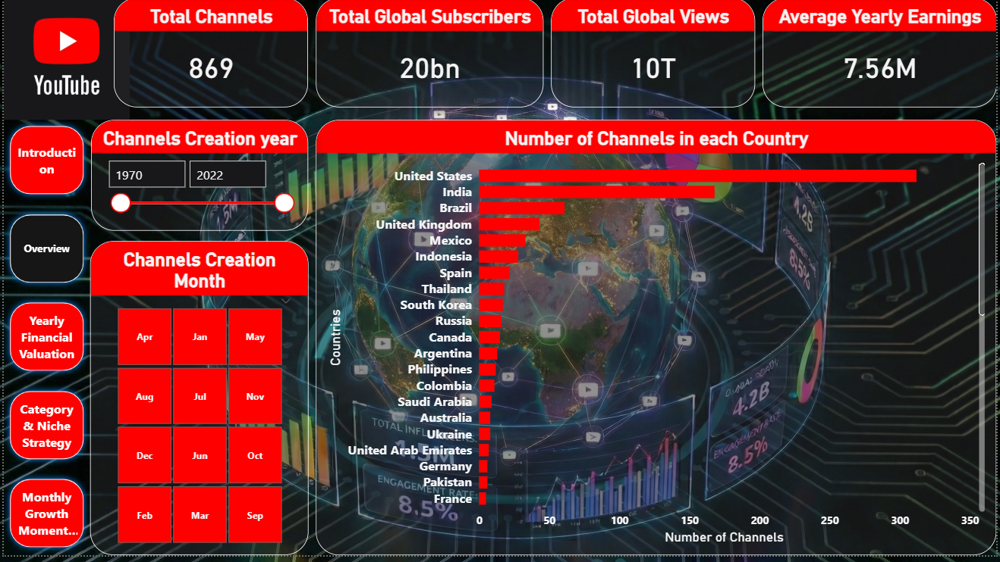
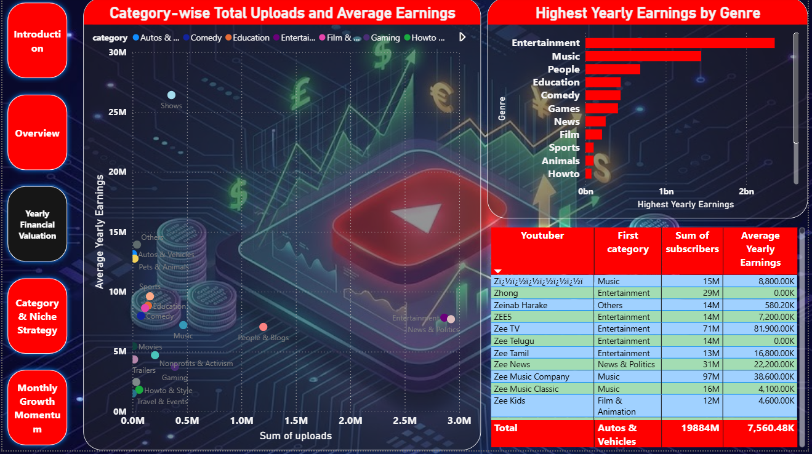
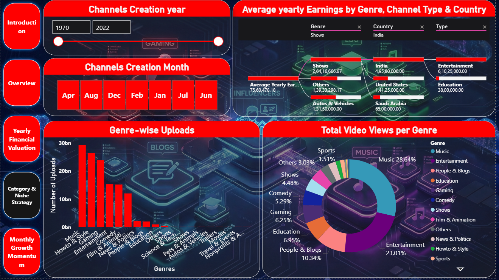
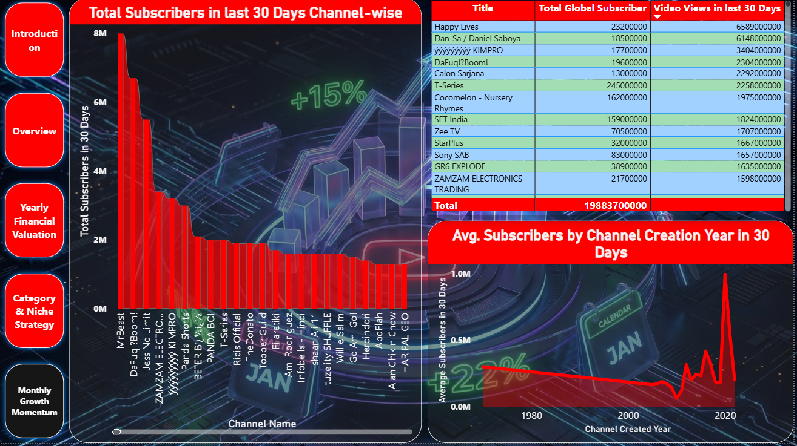

# YouTube Influencer & Social Media Analytics Dashboard

An interactive Power BI dashboard designed to analyze and visualize global YouTube statistics. This project explores the performance of top-tier content creators, providing insights into subscriber growth, engagement metrics, and estimated earnings across different categories and geographic regions.

## 📊 Dashboard Overview
The final dashboard provides a comprehensive view of the YouTube landscape, allowing users to:
* **Identify Top Performers:** Filter by subscribers, video views, and country rank.
* **Category Analysis:** Breakdown of which content types (Music, Entertainment, Education, etc.) dominate the platform.
* **Geospatial Insights:** Visualize the concentration of top influencers globally.
* **Financial Estimates:** Analyze the relationship between views and potential yearly earnings.

## 🖼️ Screenshots
Below are the snapshots of the final Power BI reports:

## 🛠️ Tech Stack
* **Power BI Desktop:** For data modeling, DAX calculations, and visualization.
* **Power Query:** For data cleaning (handling nulls in earnings and country data).
* **Python/Pandas:** (Optional) Used for initial data profiling.

## 📁 Dataset
The project utilizes the `Global YouTube Statistics.csv` dataset, which contains detailed metrics for the most popular YouTubers.

## 🚀 How to Use
1. Clone this repository.
2. Open the `.pbix` file using Power BI Desktop.
3. If prompted for data sources, point the connection to the included `Global YouTube Statistics.csv` file.

## 📜 License
This project is licensed under the Apache License 2.0 - see the [LICENSE](LICENSE) file for details.
